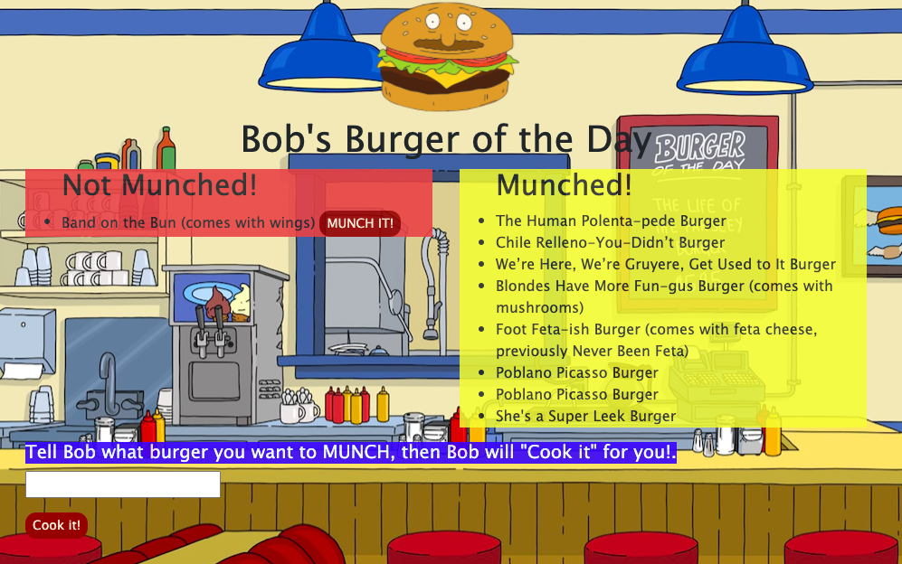

# **Burger Logger**

This super fun and functional app allows peeps to keep track of the burgers they are "munching" and they can also add a new burger to the menu. 

## Table of contents

- [Description](#Description)
- [Installation](#Installation)
- [Usage](#Usage)
- [Licenses](#Licenses)
- [Contributors](#Contributors)
- [Test](#Test)
- [GitHub Info](#GitHub) 
- [Links](#Links) 

## Description
         This app uses MySQL, Node, Express, Handlebars and a homemade ORM. 

## Installation

        npm install express
        npm install express-handlebars
        npm install mysql

## Usage

Productivity and fun!

## Licenses

## Contributors

## Test

Tests: done and pass with flying colors.

## GitHub

- [GitHub Profile](https://github.com/paulinalo22)

## Links

[Link to Pauli's Portfolio](https://paulinalo22.github.io/new_improved_portfolio/)
